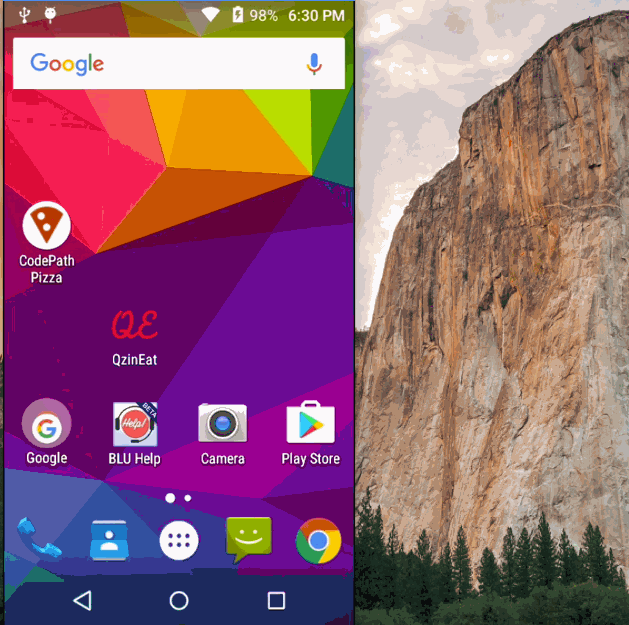

# CodePath - Fragments Sample App

Working sample code for simple app demonstrating fragments in Android. Key topics covered:

* Static Fragment
* Dynamic Fragment
* Communicating with Fragments
* Fragments in different Layout

## Attribution

This code was created by [Shyam Rokde](https://github.com/mysgithub) in 2016 for use in CodePath sessions.

## Video Walkthrough

GIF created with [LiceCap](http://www.cockos.com/licecap/).

